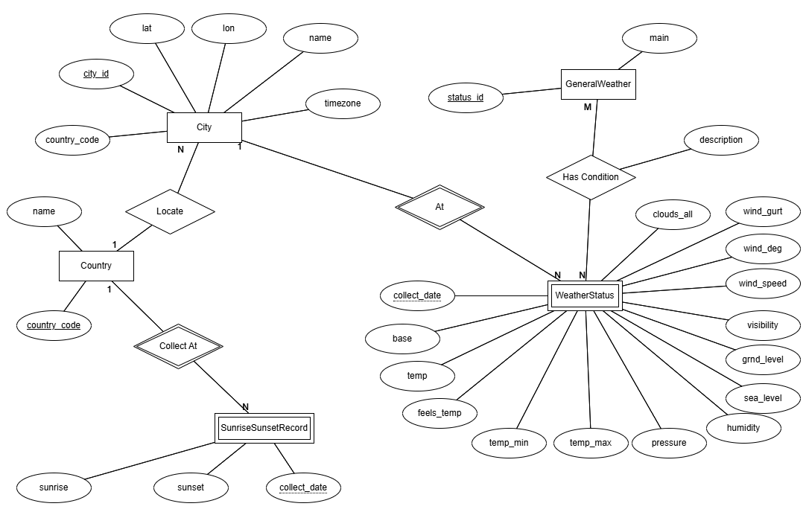

# DỮ LIỆU
## Dữ liệu gốc
Ví dụ sau là một JSON thu được từ API này với thành phố Hà Nội.
```json
{
    "coord": {
        "lon": 105.8466,
        "lat": 21.0307
    },
    "weather": [
        {
            "id": 800,
            "main": "Clear",
            "description": "clear sky",
            "icon": "01n"
        }
    ],
    "base": "stations",
    "main": {
        "temp": 291.78,
        "feels_like": 291.21,
        "temp_min": 291.78,
        "temp_max": 291.78,
        "pressure": 1015,
        "humidity": 58,
        "sea_level": 1015,
        "grnd_level": 1014
    },
    "visibility": 10000,
    "wind": {
        "speed": 2.92,
        "deg": 155,
        "gust": 5.12
    },
    "clouds": {
        "all": 0
    },
    "dt": 1737294167,
    "sys": {
        "country": "VN",
        "sunrise": 1737243363,
        "sunset": 1737283086
    },
    "timezone": 25200,
    "id": 1561096,
    "name": "Xom Pho",
    "cod": 200
}
```
## Giải thích các trường thông tin
Giải thích về các trường thông tin như sau:
* coord: Thông tin tọa độ địa lý của thành phố.
  * lon: Kinh độ.
  * lat: Vĩ độ.
* weather: Thông tin thời tiết chung
  * id: Mã định danh dạng thời tiết.
  * main: Mô tả ngắn gọn.
  * description: Diễn tả chi tiết.
  * icon: Biểu tượng thời tiết.
* base: Nền tảng của dữ liệu.
* main: Thông tin chính về điều kiện thời tiết.
  * temp: Nhiệt độ hiện tại (Kevin).
  * feels_like: Nhiệt độ cảm nhận thực tế.
  * temp_min: Nhiệt độ thấp nhất trong ngày.
  * temp_max: Nhiệt độ cao nhất trong ngày.
  * pressure: Áp suất khí quyển (hPa).
  * humidity: Độ ẩm (%)
  * sea_level: Áp suất tại mực nước biển.
  * grnd_level: Áp suất tại mặt đất.
* visibility: Tầm nhìn xa (mét).
* wind: Thông tin về gió.
  * speed: Tốc độ gió (m/s).
  * deg: Hướng gió (độ).
  * gust: Giật gió (m/s).
* clouds: Thông tin về mây.
  * all: Tỉ lệ mây phủ (%)
* dt: Thời gian dữ liệu được tính toán (dấu thời gian UNIX).
* sys: Thông tin hệ thống.
  * country: Mã quốc gia (ISO 3166-1 alpha-2)
  * sunrise: Thời gian mặt trời mọc (UNIX).
  * sunset: Thời gian mặt trời lặn (UNIX).
* timezone: Múi giờ của vị trí (giây lệch so với UTC).
* id: Mã định danh của thành phố.
* name: Tên thành phố.
* cod: Trạng thái HTTP.
## Mô hình hóa dữ liệu
### Mô hình logic
Mô hình logic được diễn tả qua biểu đồ ERD dưới đây.

Trong đó ý nghĩa của các thực thể:
* City đại diện cho 1 thành phố.
* Country đại diện cho 1 quốc gia.
* SunriseSunsetRecord đại diện cho thời gian mặt trời mọc/lặn ở 1 quốc gia trong 1 ngày.
* GeneralWeather đại diện cho các kiểu thời tiết được mã hóa.
* WeatherStatus đại diện cho tình trạng thời tiết tại 1 thành phố trong 1 ngày.
### Mô hình vật lý
Dựa trên biểu đồ ERD, dữ liệu được chia thành các bảng như sau để đảm bảo chuẩn 3NF.
1. Bảng city gồm city_id (khóa chính), lat, lon, name, timezone, country_code (khóa ngoài tới bảng country). 
2. Bảng country gồm country_code (khóa chính), name.
3. Bảng country_record gồm sunrise, sunset, collect_date (ngày thu thập dữ liệu, khóa chính) và country_code (khóa ngoài tới bảng country).
4. Bảng general_weather gồm status_id(khóa chính), main, description. 
5. Bảng weather_status gồm city_id (khóa chính, đồng thời là khóa ngoài liên kết với bảng city), collect_date (khóa chính), base, temp, feels_temp, temp_max, temp_min, pressure, humidity, sea_level, grnd_level, visibility, wind_speed, wind_deg, wind_gust, clouds_all.
6. Bảng weather_condition gồm city_id và collect_date (khóa chính, đồng thời là khóa ngoài tới weather_status), general_weather_status (khóa chính, đồng thời là khóa ngoài tới general_weather), description.
Các bảng được triển khai trên hệ quản trị MySQL.
Việc tạo các bảng tương ứng xem trong file [ddl.sql](ddl.sql).