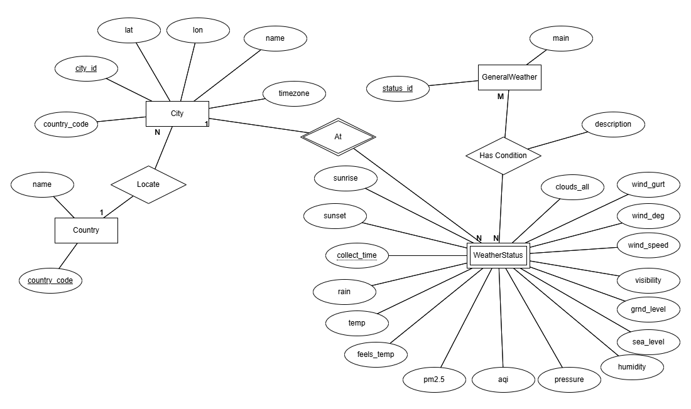

# DỮ LIỆU
## Dữ liệu gốc
### Dữ liệu về thời tiết chung
Ví dụ sau là một JSON thu được từ API này với thành phố Hà Nội.
```json                         
{
   "coord": {
      "lon": 7.367,
      "lat": 45.133
   },
   "weather": [
      {
         "id": 501,
         "main": "Rain",
         "description": "moderate rain",
         "icon": "10d"
      }
   ],
   "base": "stations",
   "main": {
      "temp": 284.2,
      "feels_like": 282.93,
      "temp_min": 283.06,
      "temp_max": 286.82,
      "pressure": 1021,
      "humidity": 60,
      "sea_level": 1021,
      "grnd_level": 910
   },
   "visibility": 10000,
   "wind": {
      "speed": 4.09,
      "deg": 121,
      "gust": 3.47
   },
   "rain": {
      "1h": 2.73
   },
   "clouds": {
      "all": 83
   },
   "dt": 1726660758,
   "sys": {
      "type": 1,
      "id": 6736,
      "country": "IT",
      "sunrise": 1726636384,
      "sunset": 1726680975
   },
   "timezone": 7200,
   "id": 3165523,
   "name": "Province of Turin",
   "cod": 200
}                    
```
Giải thích về các trường thông tin như sau:
* coord: Thông tin tọa độ địa lý của thành phố.
  * lon: Kinh độ.
  * lat: Vĩ độ.
* weather: Thông tin thời tiết chung
  * id: Mã định danh dạng thời tiết.
  * main: Mô tả ngắn gọn.
  * description: Diễn tả chi tiết.
  * icon: Biểu tượng thời tiết.
* base: Nền tảng của dữ liệu.
* main: Thông tin chính về điều kiện thời tiết.
  * temp: Nhiệt độ hiện tại (Kevin).
  * feels_like: Nhiệt độ cảm nhận thực tế.
  * temp_min: Nhiệt độ thấp nhất trong ngày.
  * temp_max: Nhiệt độ cao nhất trong ngày.
  * pressure: Áp suất khí quyển (hPa).
  * humidity: Độ ẩm (%)
  * sea_level: Áp suất tại mực nước biển.
  * grnd_level: Áp suất tại mặt đất.
* visibility: Tầm nhìn xa (mét).
* wind: Thông tin về gió.
  * speed: Tốc độ gió (m/s).
  * deg: Hướng gió (độ).
  * gust: Giật gió (m/s).
* rain: Lượng mưa (mm/h) (có thể không xuất hiện).
* clouds: Thông tin về mây.
  * all: Tỉ lệ mây phủ (%)
* dt: Thời gian dữ liệu được tính toán (dấu thời gian UNIX).
* sys: Thông tin hệ thống.
  * country: Mã quốc gia (ISO 3166-1 alpha-2)
  * sunrise: Thời gian mặt trời mọc (UNIX).
  * sunset: Thời gian mặt trời lặn (UNIX).
* timezone: Múi giờ của vị trí (giây lệch so với UTC).
* id: Mã định danh của thành phố (đã bị thay thế).
* name: Tên thành phố (đã bị thay thế).
* cod: Trạng thái HTTP.
### Dữ liệu về chất lượng không khí
```json           
{
  "coord":[
    50,
    50
  ],
  "list":[
    {
      "dt":1605182400,
      "main":{
        "aqi":1
      },
      "components":{
        "co":201.94053649902344,
        "no":0.01877197064459324,
        "no2":0.7711350917816162,
        "o3":68.66455078125,
        "so2":0.6407499313354492,
        "pm2_5":0.5,
        "pm10":0.540438711643219,
        "nh3":0.12369127571582794
      }
    }
  ]
}
```
Giải thích về các trường thông tin như sau:
* coord: Thông tin tọa độ địa lý của thành phố.
  * lon: Kinh độ.
  * lat: Vĩ độ.
* aqi: Chỉ số aqi (được phân loại dựa trên các chỉ số khác trong components, chi tiết xem tại [API](https://openweathermap.org/api/air-pollution))
* components: Nồng độ chất ô nhiễm tính bằng μg/m^3 (CO, NO, NO2, O3, SO2, PM2.5, PM10, NH3)
* dt: Thời điểm lấy dữ liệu
### Dữ liệu về các thành phố của Việt Nam
Mỗi thành phố của Việt Nam sẽ mang mã của tỉnh (định danh duy nhất) được lấy từ nguồn sau:
[Định danh theo CCCD](https://thuvienphapluat.vn/phap-luat/ho-tro-phap-luat/ma-63-tinh-thanh-pho-su-dung-tren-the-can-cuoc-cong-dan-gan-chip-y-nghia-ma-so-can-cuoc-cong-dan-ga-986546-31326.html#google_vignette)
## Mô hình hóa dữ liệu
### Mô hình logic
Mô hình logic được diễn tả qua biểu đồ ERD dưới đây.

Trong đó ý nghĩa của các thực thể:
* City đại diện cho 1 thành phố.
* Country đại diện cho 1 quốc gia.
* GeneralWeather đại diện cho các kiểu thời tiết được mã hóa.
* WeatherStatus đại diện cho tình trạng thời tiết tại 1 thành phố trong 1 ngày.
### Mô hình vật lý
Dựa trên biểu đồ ERD, dữ liệu được chia thành các bảng như sau để đảm bảo chuẩn 3NF.
1. Bảng city gồm city_id (khóa chính), lat, lon, name, timezone, country_code (khóa ngoài tới bảng country). 
2. Bảng country gồm country_code (khóa chính), name.
3. Bảng general_weather gồm status_id(khóa chính), description. 
4. Bảng weather_status gồm city_id (khóa chính, đồng thời là khóa ngoài liên kết với bảng city), collect_time (khóa chính), temp, feels_temp, pressure, humidity, sea_level, grnd_level, visibility, wind_speed, wind_deg, wind_gust, clouds_all, rains, aqi, pm2.5, sunrise, sunset.
5. Bảng weather_condition gồm city_id và collect_time (khóa chính, đồng thời là khóa ngoài tới weather_status), general_weather_status (khóa chính, đồng thời là khóa ngoài tới general_weather), description.

Các bảng được triển khai trên hệ quản trị MySQL. Việc tạo các bảng tương ứng xem trong file [ddl.sql](ddl.sql).
## Dữ liệu khởi tạo

Dữ liệu trong bảng general_weather được khởi tạo từ trước, được lấy từ link của OpenWeatherMap

[Mã hóa các General Weather Status](https://openweathermap.org/weather-conditions)

Việc thêm vào CSDL có thể xem trong file [init_general_weather.sql](init_general_weather.sql)

Dữ liệu trong bảng city được lấy và thêm vào (lúc đầu có thể không cần lon và lat) từ đường link [Định danh theo CCCD](https://thuvienphapluat.vn/phap-luat/ho-tro-phap-luat/ma-63-tinh-thanh-pho-su-dung-tren-the-can-cuoc-cong-dan-gan-chip-y-nghia-ma-so-can-cuoc-cong-dan-ga-986546-31326.html#google_vignette)

Trong dự án này, tôi lấy ban đầu 10 thành phố:
1. Thành phố Hà Nội (TW) (001).
2. Thành phố Tuyên Quang (tỉnh Tuyên Quang) (008).
3. Thành phố Điện Biên Phủ (tỉnh Điện Biên) (011).
4. Thành phố Sơn La (tỉnh Sơn La) (014).
5. Thành phố Việt Trì (tỉnh Phú Thọ) (025).
6. Thành phố Vinh (tỉnh Nghệ An) (040).
7. Thành phố Đà Nẵng (TW) (048).
8. Thành phố Hồ Chí Minh (TW) (079).
9. Thành phố Cần Thơ (TW) (092).
10. Thành phố Cà Mau (tỉnh Cà Mau) (096).

`lon` và `lat` của các thành phố khi không có sẵn sẽ được lấy từ api của openweathermap.

Dữ liệu ban đầu có thể được thêm vào từ file [init_city.sql](init_city.sql)